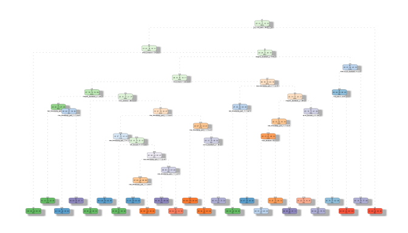
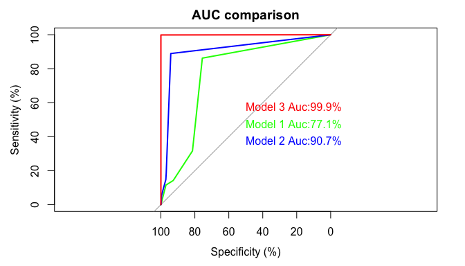

# Project for Practical Machine Learning
Alexander Lou  
20 October 2015  

##**Background**

Using devices such as Jawbone Up, Nike FuelBand, and Fitbit it is now possible to collect a large amount of data about personal activity relatively inexpensively. These type of devices are part of the quantified self movement – a group of enthusiasts who take measurements about themselves regularly to improve their health, to find patterns in their behavior, or because they are tech geeks. One thing that people regularly do is quantify how much of a particular activity they do, but they rarely quantify how well they do it. In this project, the goal will be to use data from accelerometers on the belt, forearm, arm, and dumbell of 6 participants. They were asked to perform barbell lifts correctly and incorrectly in 5 different ways.

##**Goal**

The goal of the project is to predict the manner in which they did the exercise. 

##**Data Processing**

###**Load and Read Data**

The code below are used to load and read the data:


```r
if (!file.exists("./pml-training.csv")) 
{download.file(url="https://d396qusza40orc.cloudfront.net/predmachlearn/pml-training.csv", destfile="./pml-training.csv", method = "libcurl")}

if (!file.exists("./pml-testing.csv")) 
{download.file(url="https://d396qusza40orc.cloudfront.net/predmachlearn/pml-testing.csv", destfile="./pml-testing.csv", method = "libcurl")}

Training<-read.csv("./pml-training.csv",header = TRUE, na.strings = c("NA",""),sep=",")
Testing<-read.csv("./pml-testing.csv",header = TRUE, na.strings =  c("NA",""),sep=",")
```

The training data set has 19,622 obs and 160 variables and the testing data set has 20 obs and 160 variables. The variable **classe** has 5 levels.

###**Data Cleaning**

For data cleaning, first we will remove the columns with missing values inside. Then we will remove the variables with near zero variation as those variables will not affect to the model much. Finally we will change the variables into numeric. Also, we will load the library that needed for the model building.


```r
library(caret)
```

```
## Loading required package: lattice
## Loading required package: ggplot2
```

```r
library(randomForest)
```

```
## randomForest 4.6-12
## Type rfNews() to see new features/changes/bug fixes.
```

```r
library(rpart)
library(rpart.plot)
library(rattle)
```

```
## Loading required package: RGtk2
## Rattle: A free graphical interface for data mining with R.
## Version 3.5.0 Copyright (c) 2006-2015 Togaware Pty Ltd.
## Type 'rattle()' to shake, rattle, and roll your data.
```

```r
library(RColorBrewer)
library(pROC)
```

```
## Type 'citation("pROC")' for a citation.
## 
## Attaching package: 'pROC'
## 
## The following objects are masked from 'package:stats':
## 
##     cov, smooth, var
```


```r
Training<-Training[,colSums(is.na(Training))==0]
Testing<-Testing[,colSums(is.na(Testing))==0]

nzv <- nearZeroVar(Training, saveMetrics=TRUE)
Training <- Training[,nzv$nzv==FALSE]
nzv1<- nearZeroVar(Testing,saveMetrics=TRUE)
Testing <- Testing[,nzv1$nzv==FALSE]
Training<-Training[,-1]
Testing<-Testing[,-1]
classe1<-Training$classe
classe2<-Testing$classe
Training <- Training[, sapply(Training, is.numeric)]
Testing <- Testing[, sapply(Testing, is.numeric)]
Training$classe<-classe1
dim(Training)
```

```
## [1] 19622    56
```

```r
dim(Testing)
```

```
## [1] 20 56
```

After that, the no. of variables in both the training and testing set will be reduced to 56. 

###**Data splitting**

We will use the training set data and split into two. One is for training and one is for validation.


```r
set.seed(820910)
inTrain<-createDataPartition(y=Training$classe,p=0.6,list=FALSE)
Train1<-Training[inTrain,]
Train2<-Training[-inTrain,]
```

###**Model Building**

In here, we will use three different algorithms to build the model. They are:
1. Multi-nomial Regression
2. Decision Tree
3. Random Forest

First, we set the train control using 10 K cross validations:


```r
traincontrol<- trainControl(method = "cv", number = 10,classProbs = TRUE)
```

We start the Multi-nomial Regression first


```r
RegModel<-train(classe~.,method = "multinom", data=Train1,trControl=traincontrol)
```

```
## Loading required package: nnet
```

```r
Model1<-predict(RegModel,newdata=Train2)
```

Now we check the result of predicted result from validation dataset with its original result


```
## Confusion Matrix and Statistics
## 
##           Reference
## Prediction    A    B    C    D    E
##          A 1687  209  132  116  117
##          B  130  829  108   85  199
##          C  253  264  998  261  181
##          D   96   41   58  691   94
##          E   66  175   72  133  851
## 
## Overall Statistics
##                                          
##                Accuracy : 0.6444         
##                  95% CI : (0.6337, 0.655)
##     No Information Rate : 0.2845         
##     P-Value [Acc > NIR] : < 2.2e-16      
##                                          
##                   Kappa : 0.5501         
##  Mcnemar's Test P-Value : < 2.2e-16      
## 
## Statistics by Class:
## 
##                      Class: A Class: B Class: C Class: D Class: E
## Sensitivity            0.7558   0.5461   0.7295  0.53733   0.5902
## Specificity            0.8978   0.9175   0.8520  0.95595   0.9304
## Pos Pred Value         0.7461   0.6136   0.5100  0.70510   0.6561
## Neg Pred Value         0.9024   0.8939   0.9372  0.91334   0.9098
## Prevalence             0.2845   0.1935   0.1744  0.16391   0.1838
## Detection Rate         0.2150   0.1057   0.1272  0.08807   0.1085
## Detection Prevalence   0.2882   0.1722   0.2494  0.12490   0.1653
## Balanced Accuracy      0.8268   0.7318   0.7907  0.74664   0.7603
```

From the result, the accuracy is 64% in which is relatively low. Now we try to use Decision Tree and see will the performance get better.


```r
DecisionTree<-rpart(classe~.,method ="class", data=Train1)
Model2<-predict(DecisionTree,newdata=Train2,type="class")
confusionMatrix(Model2,Train2$classe)
```

```
## Confusion Matrix and Statistics
## 
##           Reference
## Prediction    A    B    C    D    E
##          A 2102  168   15   68   83
##          B   60 1068   44   17   99
##          C    5   57 1176   81   94
##          D   55  138   45 1026  124
##          E   10   87   88   94 1042
## 
## Overall Statistics
##                                          
##                Accuracy : 0.8175         
##                  95% CI : (0.8088, 0.826)
##     No Information Rate : 0.2845         
##     P-Value [Acc > NIR] : < 2.2e-16      
##                                          
##                   Kappa : 0.7686         
##  Mcnemar's Test P-Value : < 2.2e-16      
## 
## Statistics by Class:
## 
##                      Class: A Class: B Class: C Class: D Class: E
## Sensitivity            0.9418   0.7036   0.8596   0.7978   0.7226
## Specificity            0.9405   0.9652   0.9634   0.9448   0.9564
## Pos Pred Value         0.8629   0.8292   0.8323   0.7392   0.7888
## Neg Pred Value         0.9760   0.9314   0.9702   0.9597   0.9387
## Prevalence             0.2845   0.1935   0.1744   0.1639   0.1838
## Detection Rate         0.2679   0.1361   0.1499   0.1308   0.1328
## Detection Prevalence   0.3105   0.1642   0.1801   0.1769   0.1684
## Balanced Accuracy      0.9411   0.8344   0.9115   0.8713   0.8395
```

The accuracy has improved to almost 82% in which is quite good. The structure of the tree is look like this:


```r
fancyRpartPlot(DecisionTree,sub="")
```

```
## Warning: labs do not fit even at cex 0.15, there may be some overplotting
```



Finally we try to use Random Forest to build the model.


```
## Confusion Matrix and Statistics
## 
##           Reference
## Prediction    A    B    C    D    E
##          A 2232    2    0    0    0
##          B    0 1516    1    0    0
##          C    0    0 1367    5    0
##          D    0    0    0 1279    0
##          E    0    0    0    2 1442
## 
## Overall Statistics
##                                           
##                Accuracy : 0.9987          
##                  95% CI : (0.9977, 0.9994)
##     No Information Rate : 0.2845          
##     P-Value [Acc > NIR] : < 2.2e-16       
##                                           
##                   Kappa : 0.9984          
##  Mcnemar's Test P-Value : NA              
## 
## Statistics by Class:
## 
##                      Class: A Class: B Class: C Class: D Class: E
## Sensitivity            1.0000   0.9987   0.9993   0.9946   1.0000
## Specificity            0.9996   0.9998   0.9992   1.0000   0.9997
## Pos Pred Value         0.9991   0.9993   0.9964   1.0000   0.9986
## Neg Pred Value         1.0000   0.9997   0.9998   0.9989   1.0000
## Prevalence             0.2845   0.1935   0.1744   0.1639   0.1838
## Detection Rate         0.2845   0.1932   0.1742   0.1630   0.1838
## Detection Prevalence   0.2847   0.1933   0.1749   0.1630   0.1840
## Balanced Accuracy      0.9998   0.9993   0.9992   0.9973   0.9998
```

From the result, we can see that the accuracy for Random Forest reached to 99% and only 11 obs out of 7,846 obs are mis-predicted. We plot out the ROC curve and compared the AUC of the three model.



From the plot, we can see that the model using Random Forest to build has a high AUC than other models. Therefore, we can conclue that using Random Forest is the best option for this project and we will use that to generate the result for the test set.


```r
Result<-predict(RandomForest,newdata=Testing, type ="class")
print(Result)
```

```
##  1  2  3  4  5  6  7  8  9 10 11 12 13 14 15 16 17 18 19 20 
##  B  A  B  A  A  E  D  B  A  A  B  C  B  A  E  E  A  B  B  B 
## Levels: A B C D E
```


